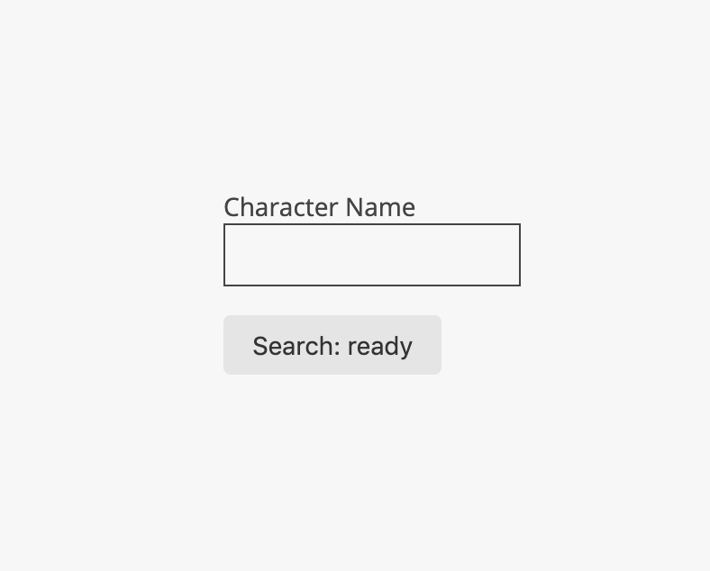

> TL;DR State machines are an interesting topic that I have not been properly introduced to even though I probably, unintentionally, use it in alot of my programming tasks/projects. I am still a bit inexperienced with modeling my UI to a state machine but I hope [these](https://css-tricks.com/using-react-and-xstate-to-build-a-sign-in-form/) [links](https://css-tricks.com/robust-react-user-interfaces-with-finite-state-machines/) [that](https://xstate.js.org/docs/) [I](https://xstate.js.org/viz/) used will help you in using state machines in JS, particularly with the xstate library and react.

So State Machines...

I am not so sure how to start to explain it but I do know it can help organize what your UI elements will do in certain states. The best way to show this is just give you the code but it gets more complex as more states are added so I will try to go step by step.

I used my [NextJs](https://github.com/ulukfuni/nextjs-boilerplate) boilerplate and added xstate with a few other libraries.

```bash
npm i -s xstate @xstate/react @rebass/forms
```

I went through the [tutorial](https://css-tricks.com/using-react-and-xstate-to-build-a-sign-in-form/) on how to make a login form using react and xstate but I found myself doing more copying and pasting than actually understanding how xstate works.

So I decided to just make a simple search input and with a submit button and I will use the Rick and Morty [API](https://rickandmortyapi.com/) to just search for a name and bring back a character from the popular Adult Swim TV show, Rick and Morty.




So XState is a configuration based library in that you will pass a configuration object into your 'machine' and it will monitor your state based on transistion actions that you pass into.

Starting with your config object:

```js
const config = {
  id: 'charSearch',
  context: {
    name: '',
    results: []
  },
  initial: 'ready',
  states: {}
}
```

`id` denotes the id of the state machine because you might use multiple state machines. `context` is basically a React State object where you can store data. `initial` denotes what the first state the machine is in and `state` is where all your states that you declare are going to be.

So let us add some states:

```js
const config = {
  ...
  states: {
    ready: {},
    error: {},
    searching: {},
    success: {}
  }
}
```
`ready` is the first state, `error` will be when something breaks or does not go as planned, `searching` will be when fire up an API request and are waiting for a response and `success` denotes that API request returned with something. I am sure I am missing a few states or can break them down further but for simpilicity (and laziness), we will use these four for now.

Next we will add transistions. These will be in CAPS and it is what we will be using to send to the machine in order to do things.

```js
import { assign } from 'xstate'
const config = {
  ...
  states: {
    ready: {
      on: {
        INPUT_NAME: {
          actions: assign((ctx, evt) => ({
            name: evt.name
          }))
        },
        SUBMIT: {
          target: 'searching'
        }
      }
    },
    ...
  }
}
```

Using the `on` property name, we can define our transistions within the ready state. `INPUT_NAME` and `SUBMIT` will be the name sent from the UI to make a transistion to another state or to do something. `target` denotes what the next state to go to is. So for example, if you send the `SUBMIT` event, the state machine will transistion from `ready` -> `searching`. Now if we want to do something when a particular transistion is sent in, we can use the `actions` property.

In order to set things in your context, you will need to use the `assign` function provided to you by xstate. It works the same as `setState` in React except if given a function for a property, the function takes two arguments, the `ctx` (context) and `evt` (event). Context is your context that was declared in the config and the event is whatever you passed in with your transistion.

Forgot to touch on one other thing, these transistions that you are declaring in the ready state will only work in the ready state. If a transistion is passed in and the state is different, nothing will happen and you will get a warning in your console. The inverse is also true, if a different transistion is sent in on ready state, warning in the console and nothing will happen.

Here is some UI code to see what sending a transistion looks like:

```js
import { useMachine } from '@xstate/react'
import { Machine } from 'xstate'
...
const rickAndMortyMachine = Machine(config)
const [ current, send ] = useMachine(ramMachine)
...
<Input
  id='email'
  name='email'
  defaultValue=''
  onChange={(e) => send({ type:'INPUT_NAME', name: e.target.value })}
/>
...
<Button
  variant="grey"
  onClick={() => send({ type: 'SUBMIT' })}
>
  Search
</Button>
```

I am using a custom React Hook `useMachine` for the XState machine and `send` is the function we will use to send transistions to our machine.

Now lets add our `searching` state information for when we send an API request to the Rick and Morty API. We are going to [invoke](https://xstate.js.org/docs/guides/communication.html) a service to do API calls.

```js
const config = {
  ...
  states: {
    ...
    searching: {
      invoke: {
        id: 'getChar',
        src: (ctx, evt) => {
          const url = `https://rickandmortyapi.com/api/character/?name=${ctx.name}`
          return fetch(url).then(res => res.json())
        },
        onDone: {
          target: 'success',
          actions:  assign({
            results: (ctx, evt) => evt.data.results
          })
        },
        onError: {
          target: 'error',
          actions: assign({ msg: 'error' })
        },
      }
    },
    ...
  }
}
```
You can invoke Promises, Callbacks, Observables or even other Machines. Here we are just using a Promise using the Fetch Web API. So once we get into the `searching` state, it immediately invokes our `getChar` service. Once the Promise resolves it goes to the `onDone` transistion and there you can assign it to your context and then pick a target state to go to. If the Promise rejects, you go to the `onError` transisition and ther you can also assign and pick another target state.

And from there you go and display your results in the success state. Thats the very gist of it. I passed over [guards](https://xstate.js.org/docs/guides/guards.html#guard-functions) (transistion will only go thru if certain conditions are met) and probably other important things but this is a small introduction into state machines using XState.

The code used in this post is [here](https://github.com/ulukfuni/state-machine-example/blob/master/pages/rickandmorty.js). I am hoping to get more use out of state machines moving forward as I can see the benefit of mapping out state before you moving to building your UI. Hope this helps you out.

