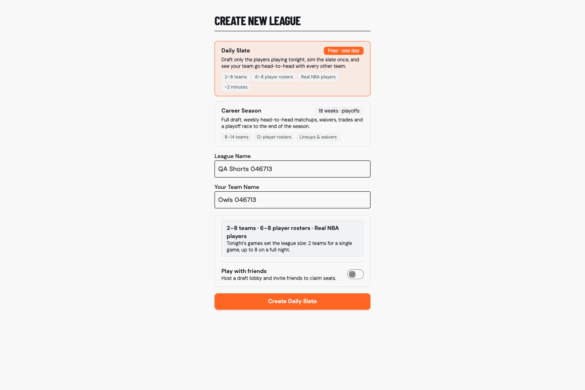
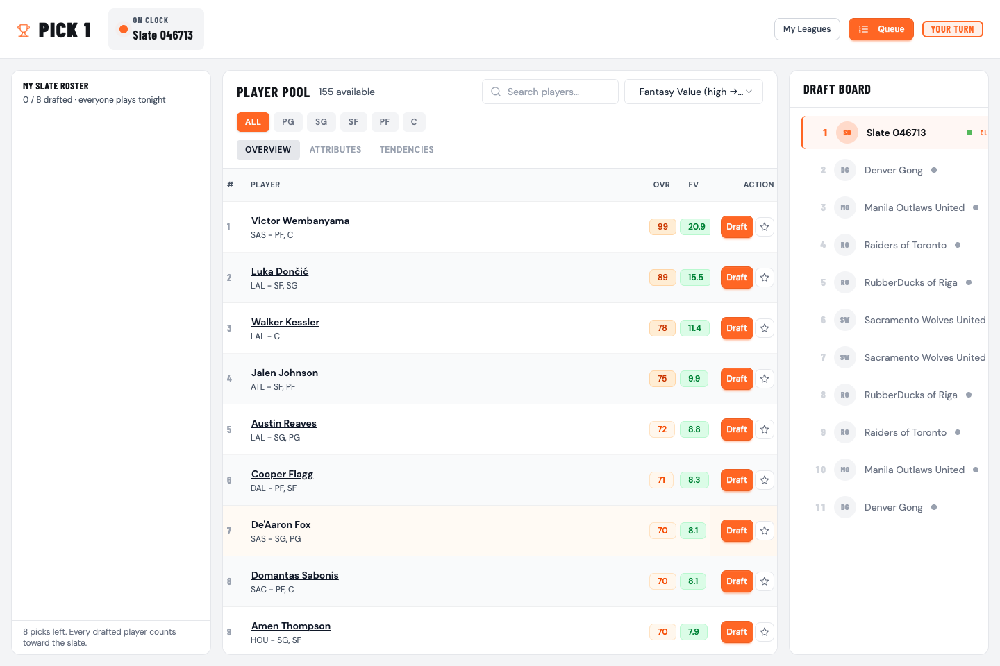
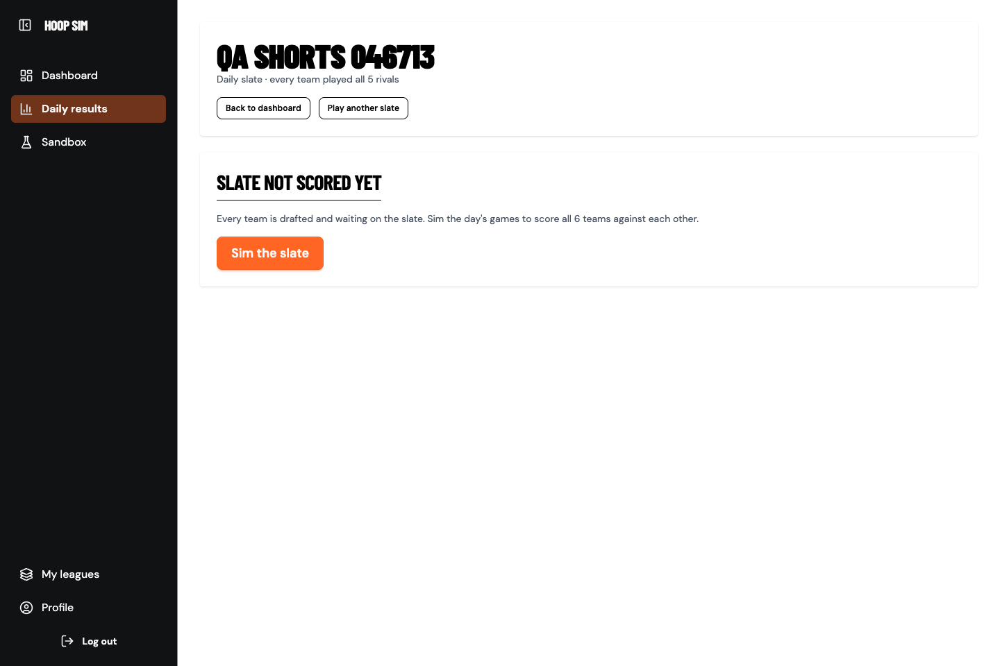
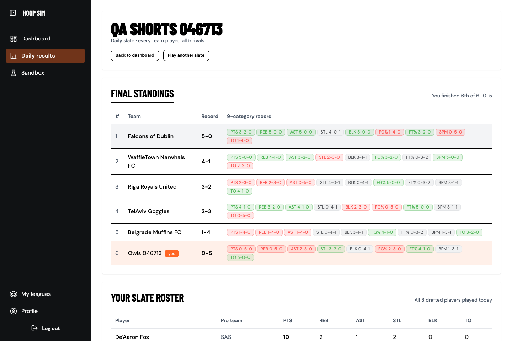
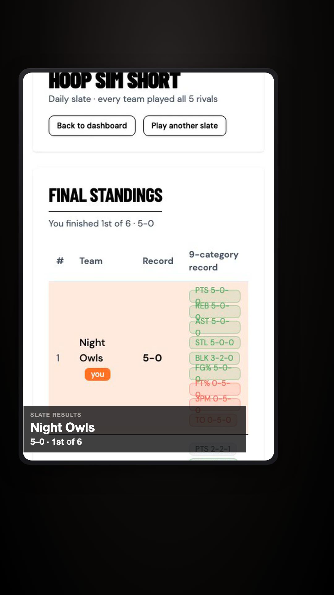

> TL;DR: HoopSim has a second way to play now. Daily Slate drafts only from players whose NBA teams play on the current, sims that one night, and scores every fantasy team head to head against every other one (28 matchups if there are 8 teams and other math bits). Also added multiplayer, playing with friends is better. Also learning how to project the next season of players with college stats for rookies and previous seasons for current players. Welcome back Hali.

In the [first devlog](/hoopsim-devlog-1/) I talked about taking the grind out of fantasy basketball. No waiting on box scores, no long season, just strategy. Career mode does that by letting you draft once and sim a whole season in minutes.

I wanted to remix the standard fantasy formula a bit. 

## What Daily Slate is

You pick Daily Slate on `/new-game` (it's the first card now, Career Season is second). Tonight's real NBA games decide everything:

- **The pool** is frozen to players on teams that play today. Nobody else is draftable. So if only the Heat play the Knicks, you are only drafting Heat and Knicks players.
- **The league** is two fantasy teams per game on the slate, capped at 8.
- **No bench.** Every player you draft gets scored.
- **One sim.** You hit **Sim the slate**, the night's games run once, and every fantasy team plays every other fantasy team with the same 9-category logic career uses. With 8 teams that's 28 pairs. The results page ranks everyone by record.

Daily sim is free on every plan, guests included. Week sim, advance day and the season sims all reject daily leagues on the server.

Those two are from a QA run on my dev backend (a 6-team night, so 15 matchups instead of 28). The team names are generated, and yes, the QA team went 0-5.

Two small gotchas:

- ESPN's team abbreviations don't all match the ones I been using in ConvexDB. `GS` is `GSW`, `NY` is `NYK`, `SA` is `SAS`, `UTAH` is `UTA`, and so on, so there's a little mapping table.
- Some schedule rows have a placeholder side like `TBD` or `LON`. Those games get dropped entirely, so a team never shows up as draftable on a night it doesn't actually play.

The sim now runs the real matchups from the schedule (not a round-robin generator), so you're scored on exactly the games your pool was drafted from. "Today" is the UTC date, which means on the East Coast it flips over at 8pm. That's something I want to revisit.

## Why it still couldn't draft on a normal night

With ~6 players per team, a normal four-game night is 8 NBA teams, so roughly 48–56 players. The league is 8 fantasy teams × 8 rounds = 64 picks. It could never fill, so `createLeague` threw `DAILY_SLATE_TOO_SMALL` on most nights. A mode called "Daily" that doesn't work most days isn't really a mode.

So a short pool gets 8 teams × 6 rounds instead of an error, and every pick gets filled. Now it only rejects a slate where a team can't even get one pick. The "next slate is…" hint uses the same math, so it doesn't send you to a date that'll fail too.

I also bumped the full-import cap from 750 to 800 so the 742-player bundle has some room. And I checked that career didn't move: against the live dev pool of 742, the career top 175 are all players who meet the minimum games played, they're spread across all 30 teams, and the cut lands at fantasy value 2.05 (the next player is 2.00).

## Shorts get a daily version too

I already had a pipeline that records career runs for short-form video. Playwright drives the app and captures it, then Remotion composes the video. Daily is a different journey, so now `SHORTS_MODE=daily` records one: create a Daily Slate, draft (capped at 8 rounds), hit **Sim the slate**, wait for **Final standings**, and scrape your rank and record off the standings panel. If the standings text doesn't parse, it fails loudly instead of rendering a broken video.

The copy changes with the mode: "Simming tonight's slate…" for the interstitial, "SLATE RESULTS" over the recap, and a rank label like "3rd of 8". Without the env var, career works exactly like before, and old `props.json` files still render.

## Multiplayer Shenanigans

I am quite happy that I chose Convex as a backend as it came with all the bells and whistles to implement multiplayer into the draft rooms. First version of HoopSim was a single player experience. I was going for a roguelike experience (single player run based arcade-y adventure). Online though, its a whole network of people who just love drafting against people.

So I brought that to both the career mode and the daily slate mode. 

## Data

The projections algorithm is still very finicky. I have been just using numbers to crunch other numbers. How do statisticians do their jobs with computers or AI or spreadsheets in the 90s? I am still tweaking the algorithm to get rankings correct compared to the big dogs (Yahoo, ESPN, Sleeper, etc). I definitely will need some more data wrangling. 