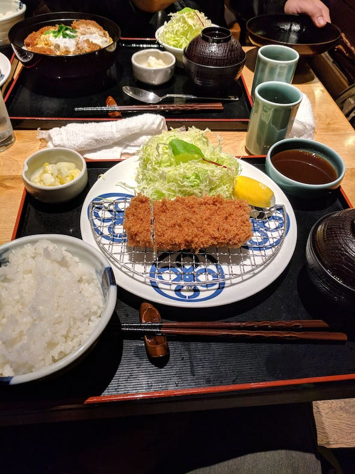
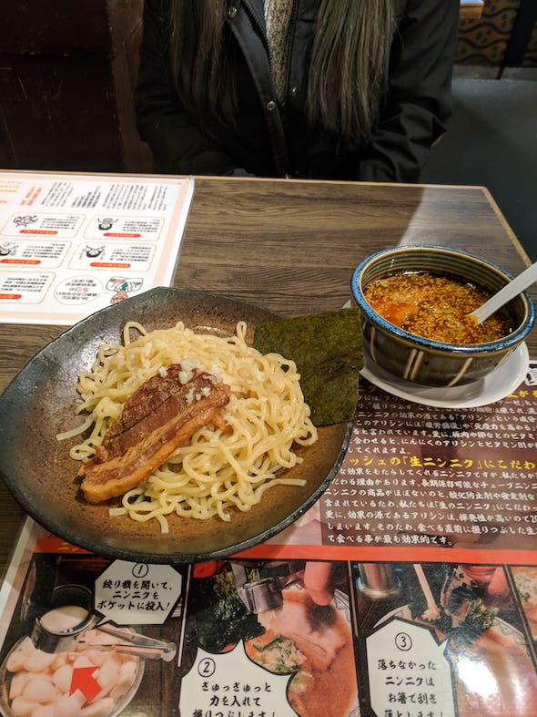

## First Things to Do After Landing in Japan

Congratulations, you have just landed in the fine country of Japan! First things first, definitely stretch your legs and whole body. No matter where you came from, sitting for that period of time is really bad for your body.

Depending on what airport you landed in, you could be heading to the luggage pick up or perhaps you could find yourself heading to a customs checkpoint. After that, you will find yourself in an area where you can purchase transit stuff and there are information booths that cater to english speakers. You can even exchange your money here.

I highly recommend purchasing a portable WIFI hotspot or maybe even exploring the option of getting an international SIM card. Traveling around without the use of Google Maps on your phone will be a nightmare. There should be a place in the area that you can rent out the hotspots or SIM cards.

## Lodging

I have had no problems using [Airbnb](https://www.airbnb.com) for lodging in Japan and all the places that I have used have been great. Most of the listings in Airbnb in Japan have hosts that generally have english descriptions. Also, you can chat with them in english as well which is a super plus.

In the past, I have used Airbnb to ask our hosts about recommendations around the area we are staying as well as directions from the airport. Generally, they have been super polite (as are most if not all of the Japanese people you come across) and super helpful.

Airbnb is good for booking with large groups (small groups too, I guess, basically all groups all sizes) but you can also try out the capsule hotels (or regular hotels for that matter).

Capsule hotels are hotels that give you a smaller space instead of entire room for your group. It is relatively cheaper than hotels and maybe even some Airbnb places but you are sacrificing some comfort for it. They basically give you a space (think a little smaller than a twin size bed and sometimes you have to climb into it with a ladder) to sleep and the bathroom/showers are public and communal but separate (one separate bathroom/shower area for males and one for females).

It is a very interesting experience and it works if you are doing a day trip to a city and need a quick place to book and stay.

## Transit

The Japan subway is the best! Clean, on time, signs are informative, and easy to use (once you know what's going on at least). First things first is you will need to purchase a [Pasmo](https://www.pasmo.co.jp/en/faq/) or Suica card. These are smart train cards that will allow you to use the subway system (you can also buy individual paper tickets but the convenience of these cards just beats paper tickets by a lot).

The card itself works like a debit card and by tapping certain spots that are marked with a symbol that looks like a IC, the system automatically deducts money from your account and you are on your way to the platform to board your train. More info on how to use the pasmo [here](https://www.pasmo.co.jp/en/use/).

Most train stations have overhead signs that show you where to go and they are written in english and also denoted by a color as well. Something like this:

Above is a google maps search (super MUST-HAVE app for traveling in Japan) between two places you will probably visit in Tokyo. Lots of helpful information here like price and which lines to take, even how many minutes of walking you have to do between transfers.

Those colors will also show up in the station when you are busy trying to get on the train. Since the trains all run on a schedule, missing one means you probably have to re-do your google maps search.

I know the Pasmo and Suica cards also allow you to take the buses but I have not tried to use those. I have heard that they are also an inexpensive way to get around as well and using them is easy as just tapping your card and away you go.

Another thing you should look into if you plan on traveling between cities across large distances is the [JR Rail Pass](https://www.japan-rail-pass.com/). The JR Rail Pass can be used with the JR line of trains for free within a certain time period. It even lets you get shinkansen (bullet train) tickets within that certain time period as well.

It is pretty pricey (around 250USD at the time of this writing for the 7 day pass), but it will pay for itself if you take a few bullet trains (one way bullet train tickets go for around 120USD if I remember correctly).

## Money

Japan is a country where cash is king.

There are a few places that will take card but make sure you have a card that does not charge an international fee. With cash being used almost everywhere, it is a good idea to either exchange at the airport or just bring your debit card to one of the 7/11 convenience stores where they have international ATMs and do exchanges there.

Make sure you have placed a travel notice on your credit/debit cards so you are not stranded in another country with no way to pay for anything.

Paper bills start at 1000 yen so anything under is coins (the denomination of coins is 500, 100, 50, 10, 5, 1 yen). You will be racking up a lot of the 1 yen coins. They feel like board game money and accumulate so fast.

I would highly recommend a coin purse (weird thing to recommend but do you really want to walk around with that much change in your pockets?).

In shops and restaurants, they do not give you the check at your seat like in the US. You will have to approach the counter/register to pay. There will usually be a small tray that you place your bills and coins in. This is customarily the way money is handled especially in smaller shops/restaurants. Also, Japan is a country where tipping for service is not necessary.

## Useful Apps

Google Maps and Google Translate are going to be your most used apps. Google Maps will load up bus and train schedules and estimate how much and all your transfers for you all while directing you. Google Translate is a no-brainer and try to have it activated on your camera for the real-time translations.

You may want to look into messaging apps that can use WIFI to message if you do not have an international SIM card installed into your phone. A few that I have used are WhatsApp, GroupMe, Facebook Messenger and LINE.

## Useful Phrases

`konnichiwa` こんにちわ

*hello*

`sumimasen` すみません

*excuse me*

`onegai shimas[u]` おねがいします

*please*

`hai` はい

*yes*

`arigatou gozaimas[u]` ありがとう ございます 

*thank you*

`gomen nasai` ごめんなさい

*I'm sorry*

`wakari-mas[u]` わかります

*I understand*

`wakari-masen` わかりません

*I don't understand*

## Food

My favorite topic!

If you did not come to Japan to eat, you are totally missing out. There is a large variety of food with a large range of prices. It is very possible to go the cheap route and still enjoy many of the cultural dishes in Japan.

Japan has many konbini (convenience stores) that offer super cheap snacks and actual food. I really enjoy the packaged onigiri (rice balls, around 2USD) and they even have lunch sets that range anywhere from 4-10 USD.

There are also a lot of ramen shops, gyudon (meat bowl) shops, sushi places, and other places that you can get a meal for under 10 USD. There is no need to break the bank to eat good in Japan.

My favorite ramen spot has to be Ichiran. It is a ramen chain all around Japan and it is the ramen spot that sports the "concentrate on your food" vibe. Well it literally makes you concentrate on your food.

To order, there is a vending machine that you place money into and press what broth and size you want. The vending machine dispenses a ticket and you bring that to the place where you will be eating. So the spot is like a small cubby with an opening for them to serve food to you and you hand the ticket to me and you fill out a form with your ramen specifications (firmness of noodles, saltiness of broth, etc.) and then you wait for you meal.

The ramen is rich and flavorful (depending on what you chose) and since the spot where you are eating is sort of isolated, it makes you focus more on your food. It's great.

If sushi is more your jam, you are definitely not going to be disappointed. There is the famous Tsukiji Fish Market (which I heard was moved into another area from its previous location), which is a market where most sushi chefs get their ingredients from and there are a bunch of vendors there that do the farm-to-table bit with their stuff you can get some of the freshest sushi right there.

Since its super famous, its probably going to be super crowded, so if you want to avoid the crowds, there are many sushi shops around all over (which, I mean, why wouldn't there be). I definitely recommend trying the conveyor belt sushi spots, the sushi's quality does not drop because its on a conveyor.

I have to give a shout out to two items that I went into glutton mode for over in Japan: ice cream and vending machine coffees. The ice cream over there is amazing. Its soft and creamy and not super sweet. Also, its cheap and they are everywhere. I think all those adjectives that describe ice cream in japan, can also apply to vending machine coffee. Its only around 1USD, its not too sweet, and they have heated cans inside the vending machine. Super fast hot coffee on the go that's cheap. Revolutionary.

All in all, try everything, you won't regret it.

## Shrines

Shrines are plentiful all throughout Japan. They are a big change of pace from the big city skyscrapers and subways and city streets. The shrines are still going to be crowded probably but if you go to the lesser known ones, it is a serene and calming experience.

So at most shrines, you can make a small prayer for good fortune at the temple, or buy good luck charms or talisman at the small shops or just marvel at the japanese traditional architecture.

## Japan Quirks

From an American going to Japan.

- When riding the escalator, there is a side where people stand and there is a side where people walk.

- When entering a department store or maybe a small to medium size restaurant, some of the staff will scream out `SUMIMASEN` (supposedly means excuse me but I am guessing its a welcoming gesture?) in a long loud tone.

- While walking around in the city streets and maybe even in the suburbs walkways, you will encounter close to zero trash cans. Explains the clean streets and sidewalks.

- When riding the subway, barely anyone speaks.

- When walking in the park, you may encounter a group of old people doing tai chi.

- In some restaurants, they encourage and sometimes enforce a no-shoe policy (locker for shoes, and everyone is given slippers).

- In some restrooms, they still have the squatty potty installed.

- In some restrooms, they have more features than just a toilet (bidet, heated seats, sounds).

- Most bathrooms do not carry paper towels.

- In some restaurants, they serve DIY green tea instead of water. Also in some restaurants, they do not ask you what you want to drink as the first thing the server asks.

- In some stores/shops, after purchasing something, the staff sometimes ties up the purchased item neatly for you. If it is raining outside, they might go the extra mile and try to rainproof the purchased item.

- Probably a circumstance of the season that I have been visiting Japan, but I have yet to see sandals or flip-flops in Japan.

- It is frowned upon to eat or drink while walking.

- Tattoos are frowned upon perhaps because of the Yakuza.

- Some cities have you walking on one side of the walkway (Tokyo, you walk on your right hand side) and then in a different city, it's the inverse.
