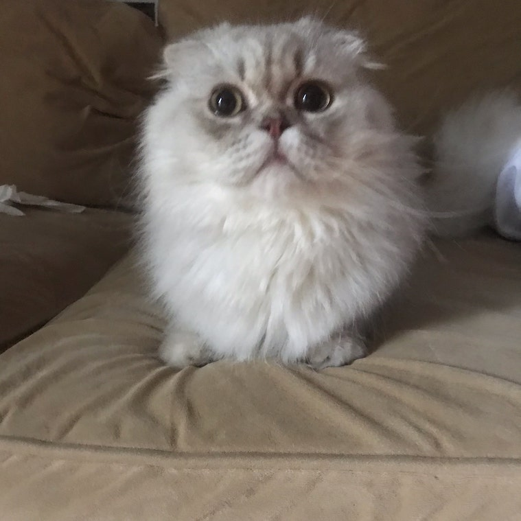
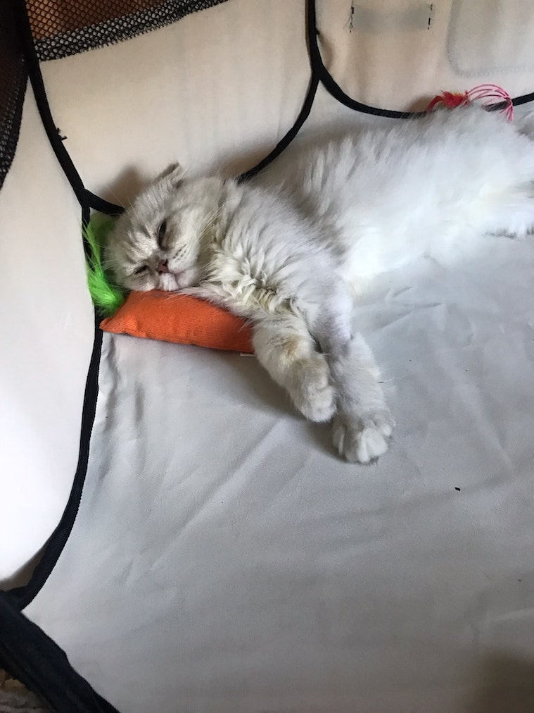

So my wife and I recieved Loki from the breeder and made the long trek back home to start the integration into our house, our family, our lives. You see, as we have read online and heard from friends, it's a process to introduce a new cat to an already existing cat. Our mainstay and docile of a black cat had unchallenged rule in our household for the last (at the time of this writing) 5 years.

She (Hades, the black fury; nightfury if you like How to train your dragon) has not taken a liking to any other animals in or around her vicinity at all. Dogs or cats, even humans. A hard to please, must-earn-her-affection kind of breed. Must be the upbringing of the streets and the [hard knock childhood that did this to her]().

So we finally arrived home and unleashed the playful cat that we have got. Instant regret as Hades started hissing and unleashing fury swipes at the small white kitten that was invading her space. We had bought a playpen tent in order to keep Loki in and tried that immediately. It was a bit small but would have to do while we gameplanned on how to handle this situation. All while Hades was circling the playpen menacingly like a shark and going in for quick jabs like a nimble boxer when me or my wife would take our eyes off of them.

We finally came to the idea of walling off the kitchen and keeping Loki there in order to give me a little more space. To give you an idea of what the kitchen is like, its like an L shape and the entrance and exit are the same with no door. We have cabinets that face each other and the fridge sits at the right angle of the L.

Since there is no door to deter Loki from leaving the kitchen, we had the bright idea of walling the kitchen off with our dining table. Essentially we laid the table down on its side, object-that-acts-as-cover-in-action-movies style. Set up a temporary litter box and had two bowls for food and water. It was a good plan for a few hours.

And then it wasn't a good plan anymore. Loki found out he can jump over the table that was walling off the kitchen. This cat has got some hoppers on him. When he found out he could, he did with consitency and conviction. He wanted to explore the outside-of-the-kitchen world, other-cat-lying-in-wait-to-kill-him be damned.

So back to the playpen tent he goes so we can figure out what's the next plan to keep this little hyper cat safe from harm.

Our next plan was to use our guest bathroom as his spot until Hades is familiar enough (we hoped it would take a month) with his smell to just tolerate him. There was no way she was okay with this and we can only hope for a co-existence between one another. Originally, we thought Hades needed a companion to soften her cold exterior. We were so wrong and so naive.

Anyway, the guest bathroom was now Loki's home base and protection from Hades. It was decided. Except my wife wanted to try and have Loki sleep with us in our room for the first night. For that first night, he would not stay still and still wanted to explore his surroundings. For him to be the exploring cat that he is, he would need a closed door away from Hades so he could have free reign in our room. And unbeknownst to his child-like mind (he still has this), Hades has a no-closed-door policy.

So began the first battle of Hades vs. Loki to assert their dominance of us, their owners. The setting: our bedroom, closed door with Loki and us sleeping and Hades on their other side of the door, free range of the house. The time: way too early for this (5 or 6 am). Hades launches the first strike by clawing at the door and crying just right outside.

Loki counters by running up to the door, curiously trying to figure out why his new roommate is crying. He foolishly tries to stick his paws under the door to offer assistance to his new roommate (bless his heart). I stare in horror and try to react to his friendly but foolish behavior but I know in my hearts of hearts that Hades is the type to fight in a flight-or-fight situation. His small, little chicken tender-like paws would not stand a chance against Hades.

No one is going to win this standoff (in actuality, Hades always wins), so I decide to sacrifice myself. I pull Loki off the door and open the door. Loki is going to stay in the room while I fend Hades off the closed door any way I can. I put the playpen tent in the way of the door to cover the area where Loki can put his paws through. It doesn't work and Hades just uses her head to force her way past the tent and to the door. I needed to add weight to the tent to keep it's place in front of the door.

So next are pillows and other objects I find around the house. I'm tired and desparate. Hades is persistent and knows she will get her way eventually. It was basically an infinite loop of me placing another object in her way, she finds a way through or cries loudly enough that it did not make a difference, I scold her and go back to the couch to try to sleep and repeat. Eventually daylight breaks and the battle is won in favor of Hades.

Loki goes back to his bathroom sanctuary and does not sleep with us in the room for another 2 months.

So basically, those type of things happened in the house for Loki's first few months. And those were just the troubles with just having to introduce Loki to Hades.

In his first week with us, we actually had to bring the little guy to the pet ER. At the time, I was working from home so I could watch over him. It was just any other day to me and I had noticed that he was not his playful self when I went in to his safe haven in the bathroom. No running around, he did not want to eat or drink anything. He was just huddled in a corner and just looked relatively faint.

I was quite fearful that the new changes in his environment (new home) caused this reaction and was super grateful that on that day, I already set up an appointment with a vet to just check him out.

I took Loki in and they discovered he had a fever and told me that fevers in kittens and young cats can turn dangerous if left unnoticed and untreated. He had to be admitted to the pet hospital for IV fluid to keep him hydrated and to monitor him. This particular hospital did not have an overnight staff so we had to pick him up and bring him to an overnight pet hospital for extra IV fluids and monitoring because he was still not stable when we picked him up at the end of the day.

That sleep the night Loki stayed overnight at the pet hospital was not a pleasant one. I readied himself for bad news but I was hopeful because as I can tell from the past few days with Loki, he was a fighter. We got the good news at like 7am the next day that we was stable and ready for pick up. They still told us to go back to his regular care provider for a quick check up and when we got there, they told us he should still be held for a bit longer and more IVs just in case.

In the end, he was discharged with a clean bill of health but the whole episode was soooo stressful and also soooo expensive. I am just very glad and grateful that I was working from home and had that appointment on the day he fell sick. Not sure how it would have turned out otherwise.

// write about ring worm and the troubles (maybe)

// hades tendency now vs. back then

// loki evolving into trouble maker (sink jumping, mirror breaking, litter spreader)

