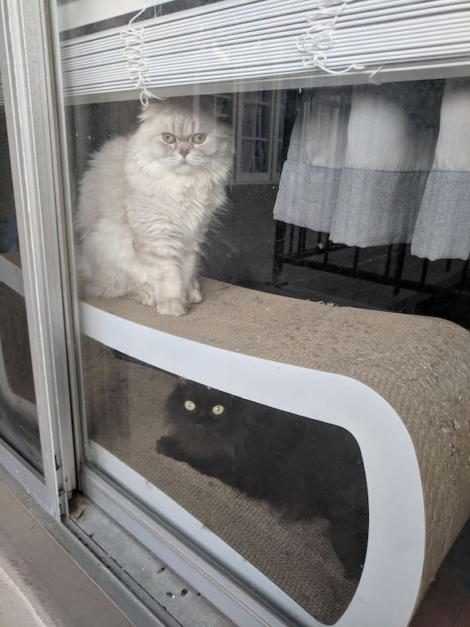
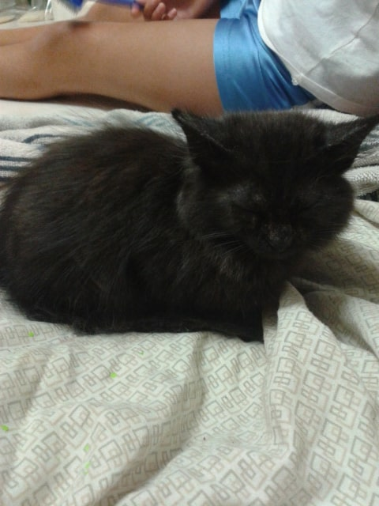
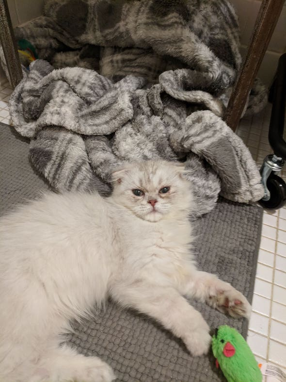

> TL;DR Cat pics and the internet have to go together so incoming cat picture post with sappy story: My journey to owning two furry animals was a very rewarding albeit stress-inducing adventure. The decision to even be a pet owner was like a knee-jerk choice but it has really humbled me and furthered my growth as a person. Pets can really enrich your life and I would super recommend one to anyone.

So I own two cats but I really feel like they own me. They sleep all day and play all night. My first cat's name is Hades (the King of the Underworld in Greek mythology) and she is almost 5 human years old at the time of this writing. She is a black domestic long haired cat. No idea what her breed is but I would say a mix of hellcat and angry fury would best describe her personality. Basically, she's an ice queen.

My other cat's name is Loki (Norse God of Mischief, see a running theme here?) and he is a one human year old (at the time of this writing) white long-hair Scottish Fold Chinchilla. He is definitely appropriately named because of all the trouble he has caused on his first successful rotation of the planet Earth around the sun. Whereas Hades is icy and edgy, Loki is a small ball of warm playful energy.

I never would have guess that I would be a cat owner in my younger years. My elementary, middle and high school self did not know the first thing about cats, never have petted one, nor hardly ever came into contact with their kind. Did not have much association with dogs either (my dad was allergic to pet hair and dander, the deadly kind I would guess from his ninja like avoidance of them). My first interaction with our smaller furry friends was when I was in high school and I was tasked with walking my cousin's dog (I stayed at their place my senior year in high school) at night.  His name was Porkchop and he was a small Yorkshire Terrier. He was one of those dogs who would cuddle with anyone that would give him attention and loved pets and rubs. He also loved trying to pick fights with any other dog ever (when I mean any, I mean any thing with four legs and in a 10 feet radius of him).

Porkchop was my first "Hey, maybe I'll get a dog one day" type of thought way back when. See, no cat thoughts or anything.

Let's fast forward to the year 2014 when I was well into college and my then-girlfriend (now wife) were sort of living together. My now-brother-in-law was working at a car dealership which had a cat colony situated relatively nearby to him and he would feed the cats of the colony (colony might imply that there was like a Lion King-esque unity between felines, but really it was just a bunch of stray cats). Maybe through sympathy, empathy or pity, he would hit up the family group chat with pics and ask if anyone would want one. He was insistent on an orange one.

I am still not sure or maybe I don't remember, but we went to his car dealership to see this orange cat. I remember distinctly that it was a dreary, rainy, wet day. In some cover, the cats were fed hard food on the ground. That was the first time I have seen so many cats. We saw the orange cat and thought "How cute". Out of the corner of both of our eyes, we saw a small black furball in the corner of the building hiding under a picnic table just staring at the pile of hard food that the other cats were eating but never moving towards it. When all the other cats were done eating was when little small black furball would make its move. By then, my wife had her mind made up and chose this little loner of a cat. She was fast, ferocious and very hard to capture but fate had other plans for this loner cat.

On the storming night of the eve of Friday the 13th with a full moon looming, we got a notification that our new addition was on its way over. She was hiding out in the car dealership's storage unit, trying to get away from the rain. With the small space and the help of coworkers, they were able to secure little loner cat in a a blue bin that they poked a hole into (Thank you Tuan). Right when I opened the box, a little black lightning shot out and went into a frenzy trying to find a safe spot. The cat went into the farthest corner of the laundry room and decided to pee in fear of its new aggressors.

Let me tell you, you never forget the first time you smell cat pee especially the smell of it when it belongs to your first cat. I picked up the cat (first time handling a cat), cleaned up the pee and with the help of my wife and her two youngest siblings (Thank you Emily and Lilian), we all gave the cat a sink bath (first time for everyone, cat included). Dirt, grime, mud and probably a few (disgusting) bugs came off. The cat was clean. We got a cage for her and fresh food and water, and a warm water bottle wrapped in a towel that would act as a mother cat's warmth. She was not going to be the loner cat at feeding time anymore. That day she became our Hades.

Fast forward a few years and a slow melting of Hades's first layer of her icy exterior, and we came to the conclusion that maybe another one of her species being around could lead to another layer slowly dissipating. By this time, I learned of other cat breeds, stared intently at all the cat pics the internet had to offer, and ooohhhhh'd and ahhhhhh'd at all the disgustingly cute kitten pictures on IG. We decided we were ready for another cat without Hades's consent.

We got Loki through a breeder (no dramatic story here, it was a very cut and dry hand off) and we were pleasantly surprised that a cat can be this warm and loving towards humans. Big smiles as we came home with him. Finally, Loki might be the last piece of the puzzle to unlock Hades's icy heart.

Nope. Big time NOPE.

If anything, Hades became a blizzard, Elsa-from-Frozen levels distant and cold and we had a whole new set of problems to deal with. The adjustment period for the two cats alone is an entire story for another time. After said adjustment period, we come to the present with me, my wife, and our yin and yang cats.

And that is how I came to have two troublesome cats but this is the life I chose and I do not have any regrets about it.

You can find more pictures of Hades and Loki [here](https://www.instagram.com/catterblack/).