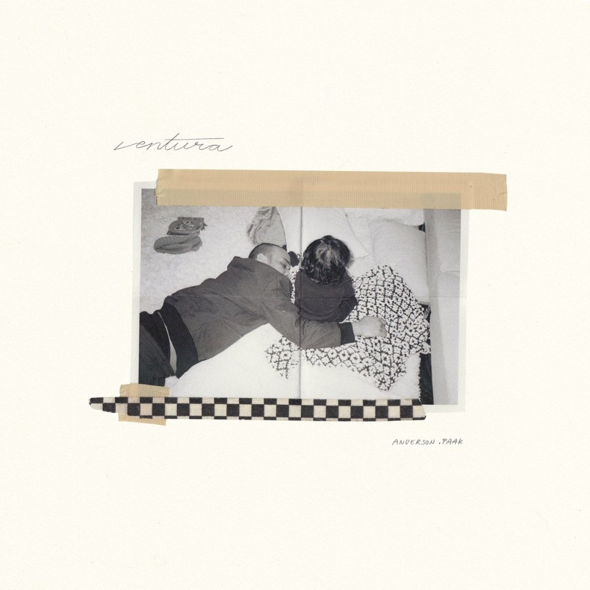
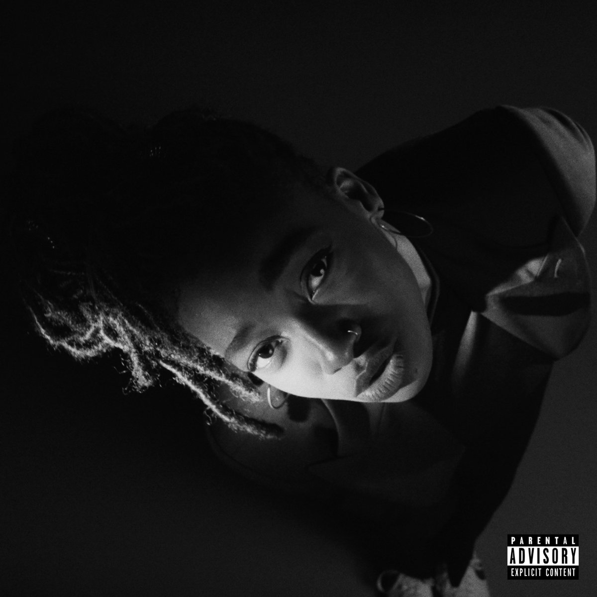
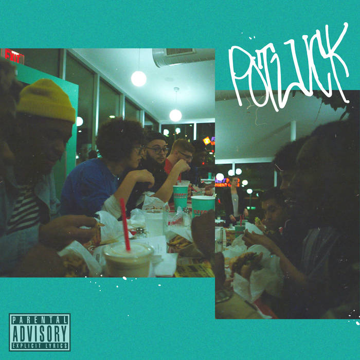
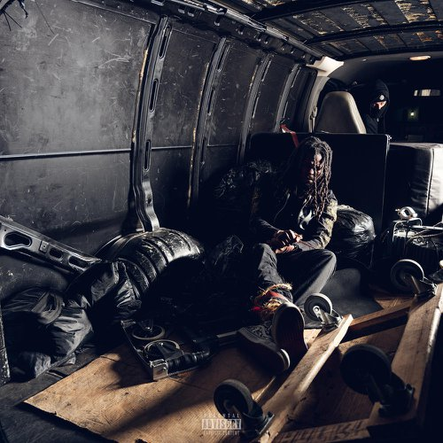
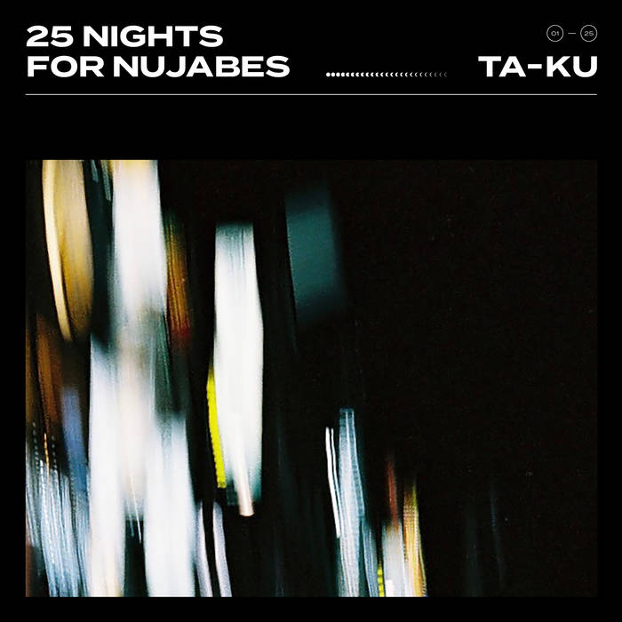
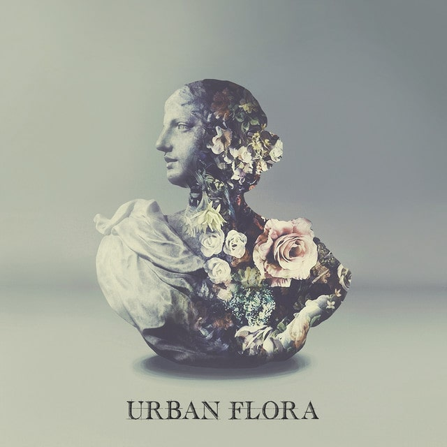

*I will list the albums I am listening to and then dive into which songs stand out to me.*

### Anderson .Paak - Ventura

[Listen](https://www.youtube.com/watch?v=hEdBe04dwms)

Standout Tracks - `Come Home`, `Winner's Circle`, `Jet Black`, `Twilight`

If you want an easy listening album filled with soul, funk, jazz and R n B, Anderson .Paak got you. Some tracks will even make you sing along or get up out your to groove to. 

`Come Home` is the first track of the album and definitely sets the whole album up with a lush opening filled with a harmony of piano and background vocals and then when Anderson finally comes in, his crooning is offset with some light guitar and bass (my music terminology sucks lol). The opening song also comes with a feature from the great feature-killer Andre 3000. It warrants a listen just from his presence alone.

My other favorite track is `Winner's Circle`. It starts with a great quote (not sure where it comes from) and I usually don't like these type of interjections in music but it works. I really like the production on this track and super love the scat-scat (right term, I hope) in the chorus. Since this album dropped, I been trying to get the scatting to mimic but always fail when I get back to listening to this track.

As I was looking through the producing credits, I saw that `Winner's Circle` was co-produced by [Vicky Farewell Nguyen](https://www.allmusic.com/artist/vicky-farewell-nguyen-mn0003472723). Though I do not know her, I think it is super awesome that there is a Vietnamese producer out there and I will now start following her work closely.

### Little Simz - GREY Area

[Listen](https://www.youtube.com/watch?v=iSSKDIcpdSE)

Standout Tracks - `Selfish`, `Venom`, `Pressure`

First time listening to a female MC from UK but she blew me away with this album. 

`Selfish` was my first introduction and it hooked me. The simple drum and bass beat layered with soft piano and the chorus really drew me in.

I think `Venom` is a clearer introduction to who Little Simz is as an artist. She has bars and a nasty flow on this track. A menacing violin starts the track off while Little Simz just launches into a tirade against her non-believers. When the drums finally drop, it sounds like this song could fit right into the semi-recent Marvel movie of the same name as this track.

### PNTHN - Potluck

[Listen](https://www.youtube.com/watch?v=pfmGxpNwtMs)

Standout Tracks - `CHUMBUCKET`, `CHROME`

Pronounced 'pantheon', I stumbled upon this 8 man group and immediately took to their sound. Imagine Bun B's, Chamillionaire's, or Paul Wall's sound brought to this era of innovation. The Potluck EP actually sounds like they took Rich Boy's "Throw Some D's" and extended its infectious sound into six songs.

`CHUMBUCKET` is a great introduction to this group and even samples Bun B in the beginning and the beat is so smooth. The members take turns flowing and really bringing back old 2008 vibes with each bar. I am looking forward to what PNTHN has in store for the future.

### Anonymuz - There is No Threat

[Listen](https://www.youtube.com/watch?v=Uo4B4cZlzDo)

Standout Tracks - `Sun Down`, `Feel So Good Pt2`, `Smoke`, `Rxdical Forever`, `No Threat`

I first found out about Anonymuz when he released an EP and it was called Urameshi and had Yusuke on the cover (from the anime, Yu Yu Hakusho). Instantly intrigued. To my surprise, the music was just as good as the anime that it was using, really good.

This latest EP features excellent production and a lyrical prowess that I really enjoy. `Feel So Good Pt2` actually has Anonymuz trying his hand at some crooning.

This EP is one where you can listen from front to back and will not find a bad song and I encourage everyone to give Anonymuz a listen.

### Ta-ku - 25 Nights for Nujabes

[Listen](https://www.youtube.com/watch?v=5Fp1viiRJnw&t=588s)

Producer Ta-ku does some good work and is a master of atmospheric and moody backdrops for artist to sing/rap to. This compilation/tribute to Nujabes has got me through many a day at work or late at night when I am doing some writing or coding.

### Alina Baraz - Urban Flora

[Listen](https://www.youtube.com/watch?v=CCYjEU4pglg)

Standout Tracks - `Show Me`, `Pretty Thoughts`

Before Alina was on her breakout hit `Electric` with Khalid, I found her with this EP and was mesmerized by the spacey production and her excellent vocals that accompany. Each song feels like you are just floating through.

### Loosies

*Single songs that I just happened upon, no album or EP accompanied.*

#### Billie Eilish - bad guy

[Listen](https://www.youtube.com/watch?v=DyDfgMOUjCI)

I like this song. Beat makes me move. Singing is not bad (can it be called singing on this one?). Song was stuck in my head for a little while so I keep on coming back.

#### Joey Bada$$ - TEMPTATION

[Listen](https://www.youtube.com/watch?v=75rKK3xyoHM)

Joey really surprised me with this one as most of his previous offerings was 90s boom-bap NY hip-hop. This one is more soulful and feels impactful. Also very catchy guitar riffs and hook.

#### Masayuki Suzuki - Love Dramatic ft. Rikka Ihara

[Listen](https://www.youtube.com/watch?v=HOSJLXTz2uQ)

Way out of left field, I know. This J-pop (not even sure if this categorizes as such) song is so catchy that I just randomly start blurting out 'Love is War, love is war, love is war' at odd times when I am alone. It feels so oldies but it really works for me.

#### Vince Staples - Big Fish

[Listen](https://www.youtube.com/watch?v=0l9kzS_B7gg)

Back to your regular scheduled music, you really feel the west coast on this song. A hook that you can just scream to your boss when you are feeling it. A bass line that can rattle a few trunks. It's perfect.

#### Jaden Smith - B , L , U , E

[Listen](https://www.youtube.com/watch?v=6aBhu3AfOiM)

This is probably going to be the only time I recommend a Jaden Smith listen because he really blew me away with this one.

It's actually four tracks but I am going to treat them as one because the tracks have continuity. The lyrics are very subpar (almost kills the vibe) but the musicality, melody, harmony and production value just outclasses any thing he does.