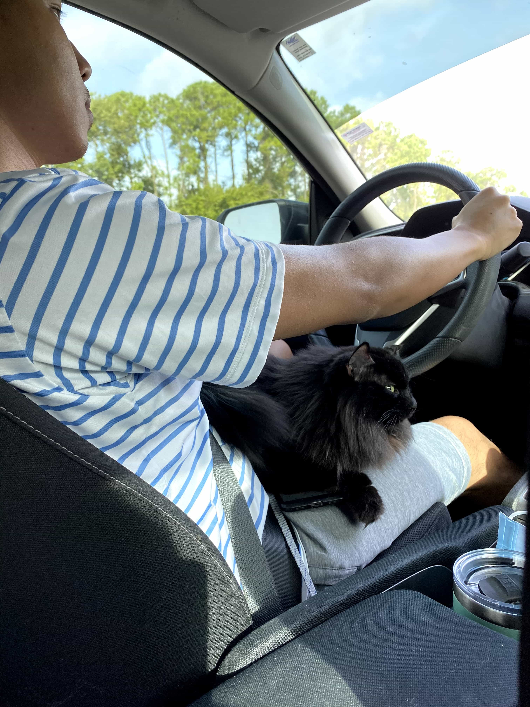

Moving. Must look forward.

In another sense, I have just completed my first out of state move into a relatively unknown place with no contacts in the immediate vicinity. It is both fresh and daunting.

It all started with a LinkedIn message from a recruiter whom I have had previously said no to about two years prior. In February of this year(2020), the recruiter messaged me if I was on the market for a new position. Since LinkedIn keeps conversation history, it showed our previous conversation about the same topic. I was surprised the recruiter still remembered me and also was still recruiting with the same company.

At that time, I might have felt a bit stagnant at my (at the time) current place of work and just said yes to their inquiry and jump started the 'let us get to know each other' of the recruitment process.

February 2020 feels like a very distant and faraway time. At that time, the whole world was just getting to know the deadly virus know as COVID-19. At that time, I was still able to go into the office but was slowly shifting into a remote state partially due to the stagnation and my laziness surrounding commuting (it wasn't even that bad though lol).

So me and the company got to 'know each other' (screening call and preliminary questions) and on the surface, I liked what I heard, and they liked what I was dishing out (by this time, I was well adept at recruiter-speak) so we were heading to an on-site interview arrangement.

The interview was scheduled in the middle of March 2020 and a few weeks before that, I was trying my hardest to get myself and my wife to get an all-expenses-paid trip up to Charlotte, NC, so we can tour the area on the company's dime. If booking flights was easier (there was a third party service choosing which flights and hotels the company can accommodate), it would have been a nice trip. Since there was a little of difficulty trying to arrange for me and my wife, that was enough time for COVID to have cases start popping up in Orlando which made me wary.

I brought that up to the company, and they understood immediately and switched my on-site interview into a remote interview. I had mixed feelings about this. On one hand, I do not have to endure an early morning/late night flight into unfamiliar territory. On the other, I lose a personal edge by establishing a rapport with the interviewers in person as opposed to through a screen or a phone. So remote interview it is then.

> Aside: Not sure if I told many people but I had an onsite interview in Austin in Winter 2019. Lets just say that I did not have the most favorable experience and that has led me to believe that out-of-state onsite interviews are basically my 'Away' game with a division rival. The unfamiliar-ness plus the flying-to day of really puts me off my game. Just showing the one side of my uneasiness with onsites. I have also had unfavorable experiences with remote interviews through Zoom/other streaming apps. Especially the portion where you have to code in front of them. I feel like I am talking to a wall and I actually don't usually verbalize my thoughts while coding so it feels like am streaming to one viewer and that viewer has the power to yes/no my interview. It is mucho nerve-wracking.

Come the day of the remote interview, I put on my best button-up and just wear shorts because they are not going to see the other half of me (hopefully). Get ready and jump onto the Zoom call. After 4 grueling hours with seven different engineers and product managers, my interview is done and honestly I recall that it did not suck. I had a good time asking and answering questions and there was no coding portion which was great.

Feeling good about my interview, I went about my day. A few weeks later, I received an offer. This part terrified me.

Big time change is hard to undergo willingly. They gave me a week to think about the offer. At the end of that week, I still did not know whether to take it or not. I asked for and receieved an extension of a week. Another agonizing week went by. What ifs and unknowns circled around my thoughts. It was a great opportunity but to leave comfort and support was scary. I talked it over with my wife. I paced around a lot and sighed a lot. I thought of people who have done a move of this magnitude and pondered whether to reach out and ask 'hey, why did you do it?' 

Ultimately, I think I just crave new experiences and I talked it over and over with my wife and over and over in my head. So I was like 'What the hell, lets do it!' And now, after countless hours of packing, lots of stress with the storage pods (another story for another time) and a stressful eight-hour car ride with a stressed out cat, I am finally in my new place in Charlotte, North Carolina.

It has been quite the journey from acceptance of the offer, to telling all the friends and family of the news, to packing and getting rid of belongings, to saying goodbyes and see-you-laters to our loved ones but I believe this choice and this move will be new life experience to look back and smile.