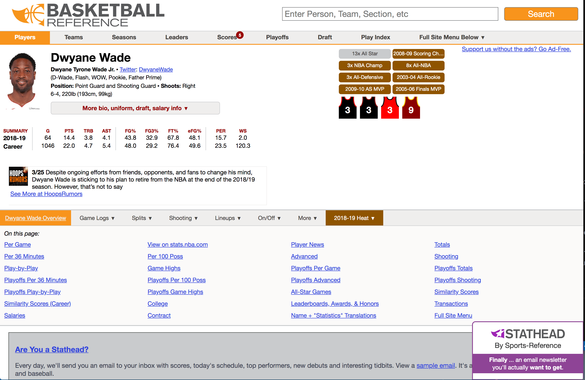

> TL;DR: I made a bunch of web scraper scripts in different languages to see which one I liked and for experimentation purposes. NodeJs was easy to work with since I worked with it in the past, PHP was easy to start up, easy to code, and low barrier for entry and Python was the hardest to get started as well as code but most fun because it was a new experience. Also as a highlight to Dwyane Wade, greatest Heat Player of all Time.

Just an experiment to see if I can do this and also to explore different languages that I have not used before for web scraping and see how fast I can adapt to them.

Web Scraping, for those who don't know, is going to a web page/site and grabbing some sort of data from the web page/site. Then you can use the data however you want. There are some unethical aspects but for this little project, we are just doing it for experimentation.

So I will be looking at ease of starting up (how much setup before I can do something cool), available libraries or packages to use (installs and such), ease of language tools (Fun Factor) and anything else I can think of in the process.

The [webpage](https://www.basketball-reference.com/players/w/wadedw01.html) we will be scraping is:


We will be grabbing the Summary Stat box. Let's get started!!!!

## NodeJs

We will first start with the language that I am super familiar with: Javascript. Here is the scorecard for my look into web scraping with Javascript:

As Javascript is the first language that I used in my professional career, it has been a constant throughout all my jobs. I have gone through jQuery all the way up to React/NodeJs.

#### Ease of Starting Up

NodeJs was pretty easy to start up with because I already had all the dependencies installed to use NodeJs. For a beginner, you would have to install [NodeJS](https://nodejs.org/en/download/) and [NPM](https://www.npmjs.com/get-npm) and then after that install the individual packages. Even before that you will need a bit of knowledge surrounding the command line/terminal. Not very hard but a few steps before you can get started.

#### Available Libraries/Packages

Since Javascript is so popular, the number of tools available to get started are numerous and there are also many tutorials out there on web scraping.

#### Fun Factor

I am glad the Basketball Reference web site we are using is somewhat proper when it comes to HTML as I have seen some crazy websites with auto-generated HTML classes that make it a pain to scrape. I only had some trouble setting up the async operations of requesting the website and then scraping the response coming back. Still a blast to write javascript.

For web scraping, I chose the [Cheerio](https://cheerio.js.org/) library (server-side jQuery) and [Axios](https://github.com/axios/axios) (http library) library to grab the HTML to parse through. You can easily go with a lesser known library called [X-ray](https://github.com/matthewmueller/x-ray) which does both of what axios and cheerio does though. For the API routing, I chose [Hapi](https://hapijs.com/) but you can easily use [Express](https://expressjs.com/) (far more popular but I wanted to try something new) instead.

Here is the scraping code in 4 lines:
```js

const url = 'https://www.basketball-reference.com/players/w/wadedw01.html'
const response = await axios.get(url)
const $ = cheerio.load(response.data)
return $('.stats_pullout').html()

```

You can take a look at the rest of the code [here](https://github.com/ulukfuni/web-scrape-blog-js).

## PHP

The second programming language I learned after Javascript is PHP and I almost forgot to try web scraping with it.

#### Ease of Starting Up

Since I have a MacBook, PHP 7 is already installed which is really nice. I believe on other OS, you would have to download it (probably just Windows). The only thing you need to install afterwards is [composer](https://getcomposer.org/) for package management. PHP even has a built in web server on the command line which makes it super easy to get started.

#### Available Libraries/Packages

I had to do a little research into different web scraping packages and I was surprised that there were a lot of to choose from. I chose [Goutte](https://github.com/FriendsOfPHP/Goutte) simply because it was the first one that showed up on google search (the power of SEO!). Since there is a built in web server for PHP, we technically do not need a package for that.

#### Fun Factor

I will probably never get used to using dollar signs to denote variables but PHP is also not a strongly typed language similarly to Javascript so I can go about coding in PHP the same way I go about coding in Javascript (Spaghetti code FTW). As an aside, I have noticed the rise in strongly typed languages and even TypeScript is growing in popularity at the time of this writing. Anyway, PHP is fairly easy to get up and running and I did not have any trouble at all. Probably the fastest from start to finish for me to write.


Here is the scraping code in 4 lines:
```php
$url = "https://www.basketball-reference.com/players/w/wadedw01.html";
$client = new Client();
$crawler = $client->request('GET', $url);
$output = $crawler->filter(".stats_pullout")->extract("_text");
```

You can take a look at the rest of the code [here](https://github.com/ulukfuni/web-scrape-blog-php).

## Python

I always had an interest in learning Python due to the supposed ease of making games and also its ties to the Data Science and Big Data movements. Lets see how it fares with a simple webpage scrape.

#### Ease of Starting Up

Just like PHP, Python is already installed on my MacBook but only Python 2 and not the latest one which is 3. So I had to go through the process of installing Python 3 and dealing with having two versions of Python installed. I also had to install [Pip](https://pypi.org/project/pip/) which is the package manager for python I suppose. After that, I was ready to install packages and start writing code.

#### Available Libraries/Packages

Python also had a bunch of libraries that are useful for web scraping and many useful tutorials around web scraping. I had a hard time choosing which one to use as I wanted to use the one that had the most stars on GitHub and landing on [BeautifulSoup](https://pypi.org/project/beautifulsoup4/). It uses a jQuery-lite look up so that is what sold it for me.


#### Fun Factor

It was a change of pace to ditch curly brackets (a JS staple) and instead use spaces to denote scope. After the initial startup, writing code was very easy even though I had to look up some JS to python equivalents (console.log equivalent in python was my first search). Since it was my first foray into the language, this took me the longest but since it was the most unknown to me, I had the most fun in using python. Kind of like getting a new car and driving it for the first time. By driving it, you discover some kinks and little flaws but you still know how to drive it since it is a car. I hope to do more little projects in python soon.

Here is the scraping code in 4 lines:
```python
url = 'https://www.basketball-reference.com/players/w/wadedw01.html'
response = get(url)
soup = BeautifulSoup(response.text, 'html.parser')
print(soup.findAll('div', class_='stats_pullout'))
```

You can take a look at the rest of the code [here](https://github.com/ulukfuni/web-scrape-blog-py).
