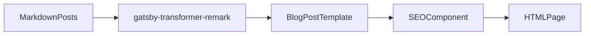

# Project architecture

This document gives a high-level map of where things live in this blog and how
content flows through Gatsby to become pages. It is meant for both humans and
AI agents.

---

## Content layout

- `content/blog/<slug>/index.md`
  - Markdown files with YAML frontmatter at the top.
  - Required frontmatter fields: `title`, `date`, `categories`, `description`, `keywords`.
  - Body is written in Markdown and can include images, code blocks, etc.
- `content/assets`
  - Shared images used by posts and pages.

Frontmatter and writing conventions are defined in `docs/blog-style-guide.md`.

---

## Routing and templates

- `gatsby-node.js`
  - Uses `onCreateNode` to add a `fields.slug` to each `MarkdownRemark` node.
  - Uses `createPages` to:
    - Create a page for each blog post using `src/templates/blog-post.js`.
    - Special-case the `/now/` slug to use `src/templates/now.js`.

- `src/templates/blog-post.js`
  - Queries a single Markdown post by `slug`.
  - Renders:
    - Title, date, and category pills.
    - Post HTML (`markdownRemark.html`).
    - Previous/next navigation.
  - Attaches SEO via `src/components/seo.js` using frontmatter `title`,
    `description`, and `keywords`.

- `src/templates/now.js`
  - Template for the `/now` page.
  - Similar to `blog-post.js` but without previous/next links.

- `src/pages/index.js`
  - Home page that lists all posts (except `/now/`), showing title, date, and
    excerpt/description.

---

## Layout and SEO

- `src/components/layout.js`
  - Shared page shell: header (site title link), main content, footer.
  - Used by index, post templates, and the `/now` page.

- `src/components/seo.js`
  - Wraps `react-helmet` to set:
    - `<title>` with a `titleTemplate` based on `siteMetadata.title`.
    - `<meta name="description">` (from prop or site default).
    - Open Graph (`og:title`, `og:description`, `og:type`).
    - Twitter card tags (`twitter:title`, `twitter:description`, `twitter:card`,
      `twitter:creator`).
    - Optional `<meta name="keywords">` when a `keywords` array is provided.

- `gatsby-config.js`
  - Defines `siteMetadata`:
    - `title`, `author`, `description`, `siteUrl`, `social`.
  - Registers core plugins:
    - `gatsby-source-filesystem` for `content/blog` and `content/assets`.
    - `gatsby-transformer-remark` (with remark plugins for images, iframes,
      PrismJS syntax highlighting, etc.).
    - `gatsby-plugin-image`, `gatsby-plugin-sharp`, `gatsby-transformer-sharp`.
    - `gatsby-plugin-feed` for RSS.
    - `gatsby-plugin-offline`, `gatsby-plugin-react-helmet`,
      `gatsby-plugin-typography`.
    - `gatsby-plugin-google-gtag` for analytics.
    - `gatsby-plugin-manifest` for PWA metadata and favicon.

---

## Scripts

- `scripts/create-post.js`
  - CLI helper to create a new post:
    - Generates a slug from the title.
    - Creates `content/blog/<slug>/index.md`.
    - Writes starter frontmatter:

      ```yaml
      ---
      title: [TITLE]
      date: 'YYYY-MM-DD'
      categories:
          - 
      description: 
      keywords:
          - 
      ---
      ```

  - After running the script, you should edit the new file to fill in
    `categories`, `description`, and `keywords` following the style guide.

---

## Content flow

The following diagram shows how Markdown becomes HTML pages:



